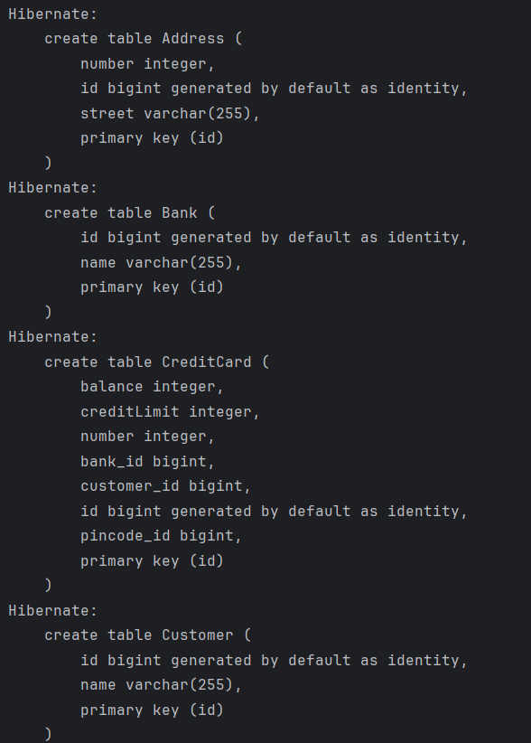
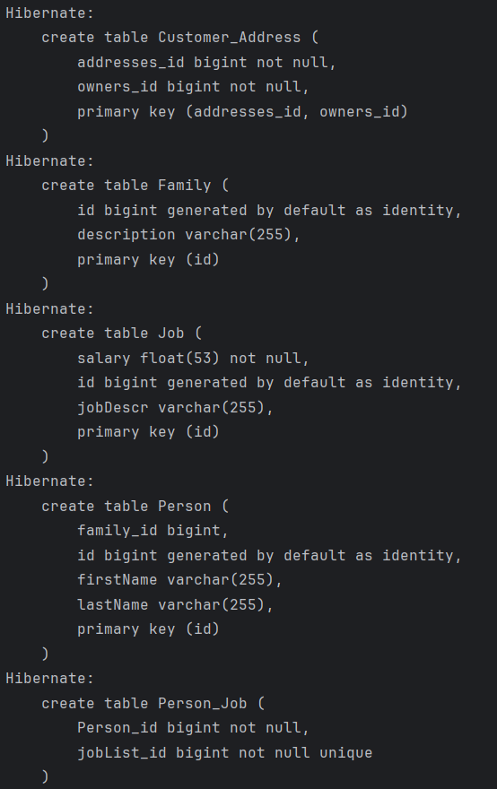
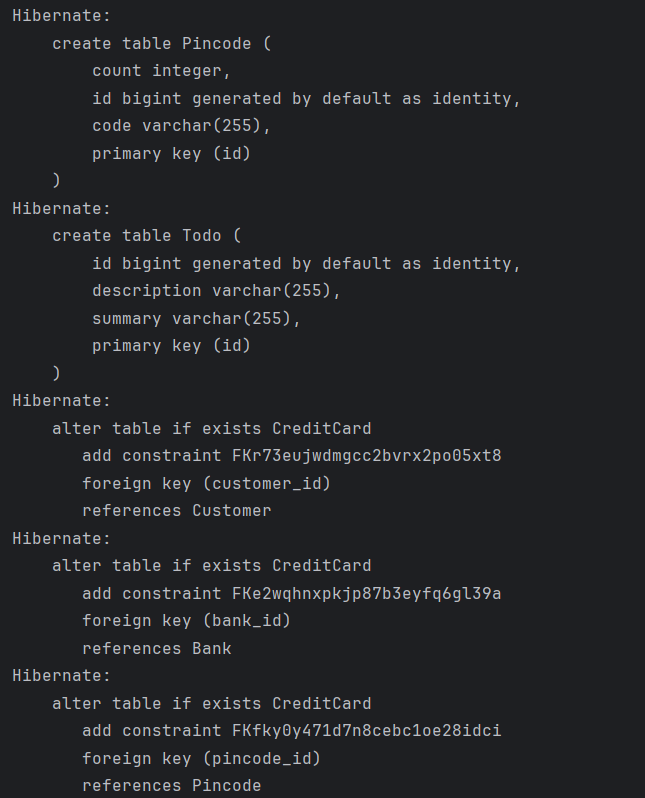
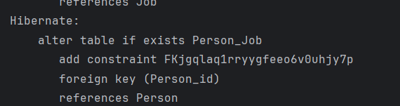

For this task I had an annoying techincal problem when starting as my SDKs were just randomly set to version 17
for no reason that I could find. This led to a LinkageError when trying to do the experiment, and it was really not
clear based on the error that the solution was just the SDK being randomly changed to an older version. I therefore 
spent a painful long time trying to just get the task started.

I also didn't really understand this part of the first task in the JPA tutorial: "Make sure you have imported the maven
project defined in the pom.xml." As I didn't find or understand where this pom.xml file was supposed to be. Luckily I 
didn't have any problems when just going to the next tasks.

I also had some difficulties with the CreditCardsMainTest multiple times expecting PersistentBags as output when I was
giving it immutuble collections, however after a lot of trying I finally made it work by just changing all collections
into sets.

Code: https://github.com/adlibe/dat250-jpa-tutorial/tree/master/src/main/java/no/hvl/dat250/jpa/tutorial 

I inspected the database tables by enabling "hibernate.show_sql" in the persistence.xml file which printed out the SQL
queries when running CreditCardsMain.. And it ended up looking like this:

I do not have any pending issues with this assignment.